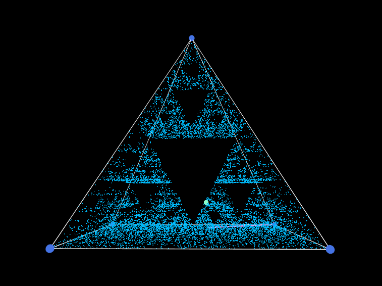
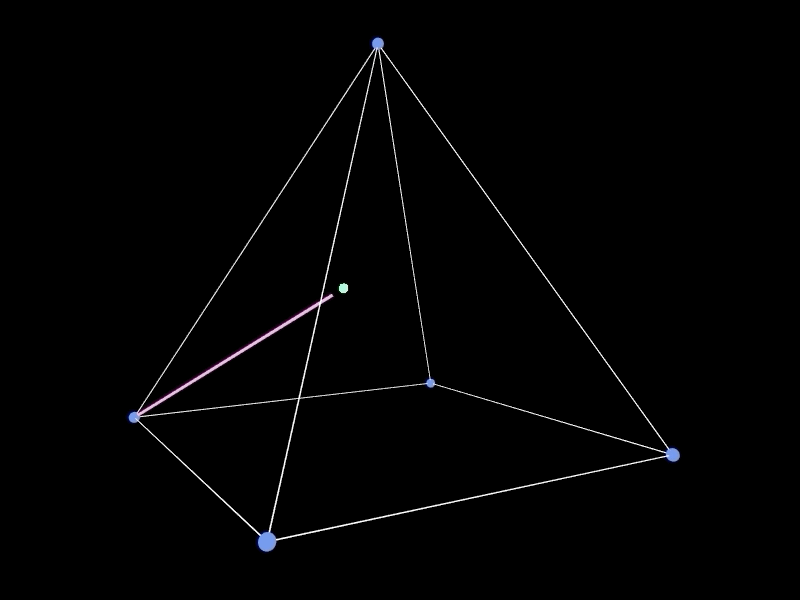

# [Chaos Game 3D](https://github.com/gregwattonville/chaos-game-3d)

A 3D animation of the [Chaos Game](https://en.wikipedia.org/wiki/Chaos_game) mathematics method of creating a fractal using [p5.js](https://p5js.org/) WebGL. A twist on the 2d implementation of Chaos Game, in this case a random initial point is chosen inside a pyramid followed by selecting a random corner. A new point is then placed at the midpoint between the random initial point and the random corner. Using the midpoint a new corner is chosen at random and the midpoint between these two is found creating a new point. The process is repeated greatly and the result is a Sierpinski pyramid.

View it online: [gregwattonville.github.io/chaos-game-3d/](https://gregwattonville.github.io/chaos-game-3d/)

## Preview

## Background

As a teacher, I want my students to explore mathematics; however, this was the result of my own exploration and wanting to learn and play around in a three deminisional space. This animation does provide a new perspective and twist on the 2D Sierpinski triangle and getting to transform pyramid in various ways makes things interesting.

## License

[MIT](LICENSE)
